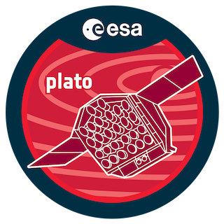

# Convolucional Neural Network for PLATO ESA Mission


## Author
<table>
<tr>
<td align="left">



</td>
<td align="left">

**Guillermo Mercant**  

AIT Engineer at the CSIC Astrobiology Centre (CAB)  
[GitHub Profile](https://github.com/Wiflys13)  
[guillermomercant@gmail.com](mailto:guillermomercant@gmail.com)

</td>
</tr>
</table>
Feel free to reach out for questions, collaborations, or feedback on this project!


# PLATO Mission Focus Temperature Prediction using CNN
This repository contains the development of a Convolutional Neural Network (CNN) designed to predict the optimal focus temperature for the PLATO space mission, led by the European Space Agency (ESA). The primary scientific goal of the PLATO mission is to detect and characterize exoplanets around Sun-like stars. The mission's success depends on achieving precise focus, which is regulated by the thermal conditions of its opto-mechanical systems.

## About the PLATO Mission
The PLATO mission (PLAnetary Transits and Oscillations of stars) aims to identify and study exoplanets by observing planetary transits and stellar oscillations. To achieve high-precision measurements, PLATO’s optical system requires optimal focus, which is adjusted based on the thermal state of its mechanisms.

During ground tests, operational space conditions are simulated to identify the ideal focus temperature. This is done by analyzing image quality at different temperatures, thus enabling calibration of the instruments prior to launch.

## Project Objective
The objective of this project is to develop a CNN-based method for determining PLATO’s focus temperature, providing an alternative approach to traditional methods. The CNN will be trained using images obtained during ground tests to facilitate:

* Pre-launch calibration based on environmental simulations,
* In-orbit calibration for ongoing adjustments during the mission.

By automating focus temperature calibration, this project aims to improve the reliability and efficiency of the mission's focus system

## Repository Structure

```
/PLATO_CNN
│
├── bibliography/        # Contiene documentos de referencia (PDFs, artículos, etc.)
├── Docs/                # Documentación del proyecto (README, guías, etc.)
├── images/              # Imágenes relacionadas con el proyecto (diagramas, gráficos, etc.)
├── src/                 # Código fuente del proyecto
│   ├── classes.py       # Clase ImagePLATO con la lógica de preprocesamiento
│   ├── config.py        # Configuraciones (rutas, prefijos, listas de OBSIDs)
│   ├── main.py          # Punto de entrada del programa
│   ├── utils/           # Funciones auxiliares (si las hay)
│   └── tests/           # Pruebas unitarias (opcional)
├── data/                # Datos del proyecto
│   ├── OBSID/           # Datos crudos (archivos CSV y FITS)
│   └── processed/       # Datos preprocesados (resultados)
├── models/              # Modelos entrenados (CNN, pesos, etc.)
├── requirements.txt     # Dependencias del proyecto
└── README.md            # Documentación principal del repositorio
```

## Getting Started
These instructions will help you set up and run the PLATO_CNN project on your local machine.
### Prerequisites
1. Python 12 or higher
2. Git (optional, for cloning the repository):
3. Virtual Environment (recommended):
    - Create a virtual environment to isolate the proyect dependencies
     `python -m venv venv `
    - Activate: `venv\Scripts\activate`
    - Install dependencies: `pip install -r requirements.txt`
### Installation
1. Clone the repository:
2. Set up the enviroment: 
   ```
   python -m venv venv
   source venv/bin/activate  # or venv\Scripts\activate on Windows
   ```
3. Install dependencies: 
   ```
   pip install -r requirements.txt
   ```
### Running the model
Run the main:
```
python -m src/main.py
```

### Results


# Acknowledgments
- Thanks to the PLATO mission team for providing the data.
- Special thanks to contributors and collaborators.

